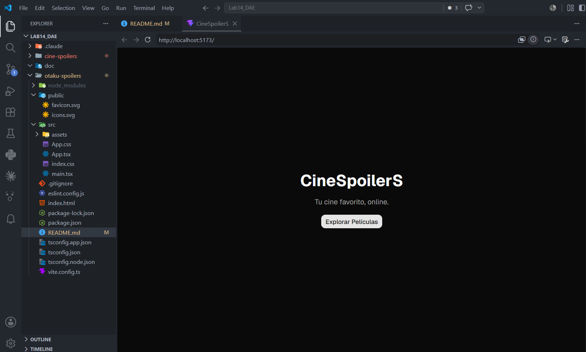
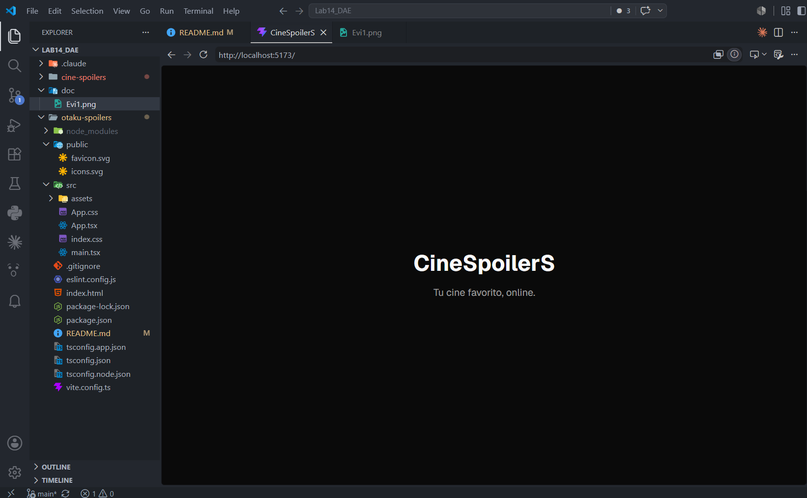
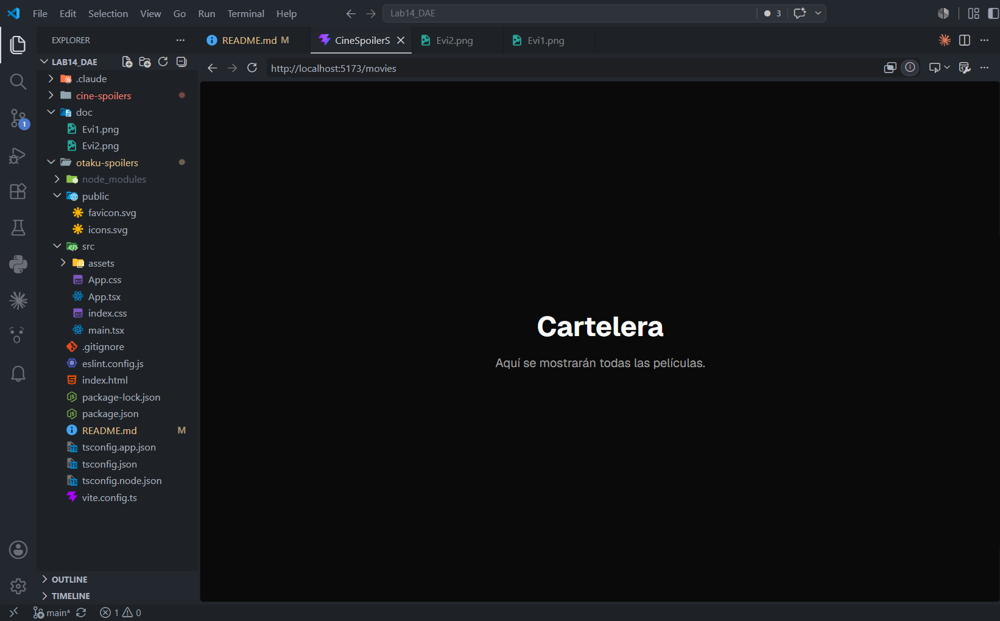
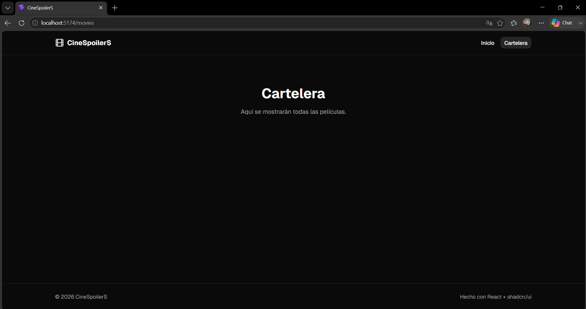
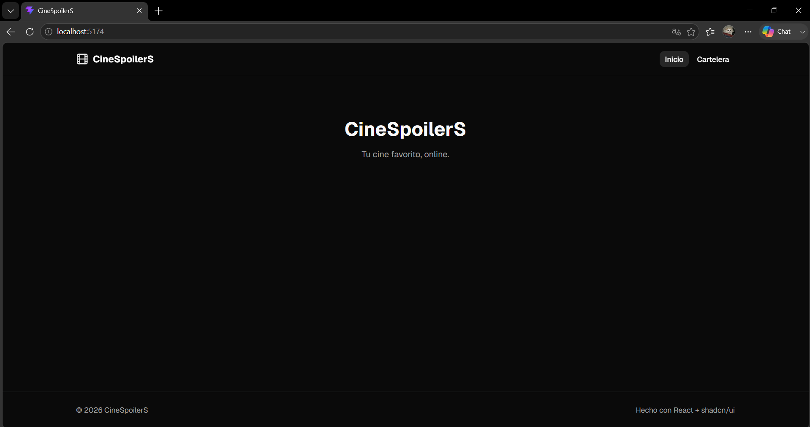
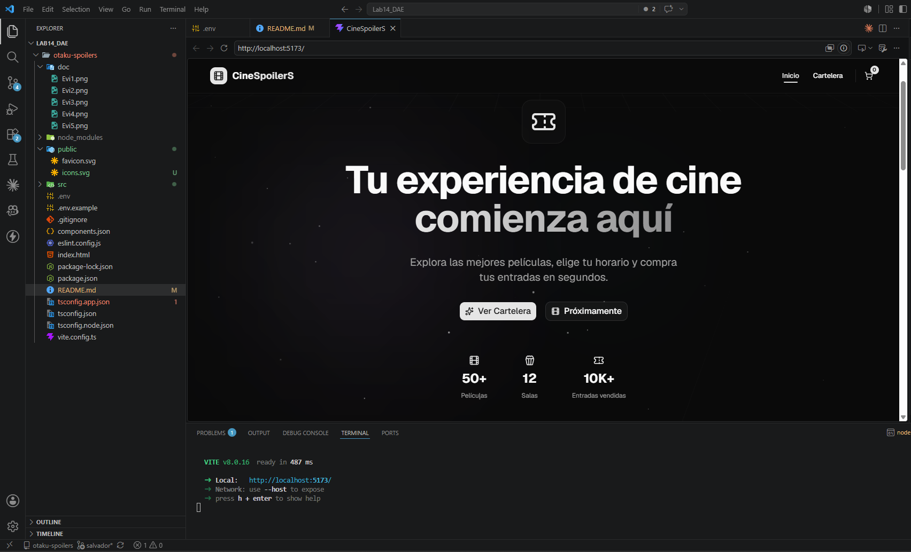
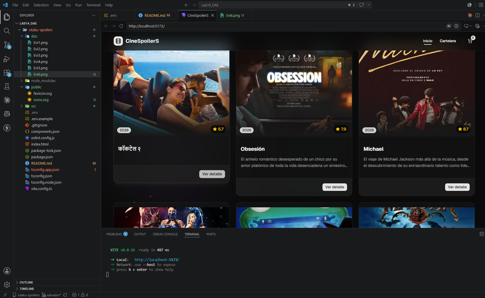
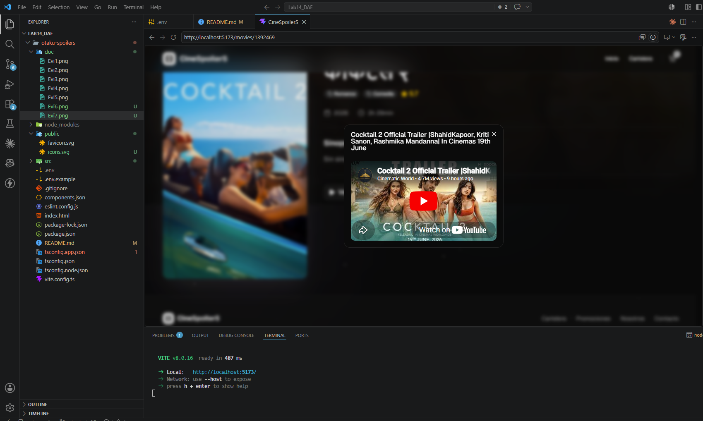

# CineSpoilerS

Aplicacion web de cartelera de cine construida con React y Vite. Permite explorar peliculas en cartelera, ver detalles como sinopsis, generos, duracion y puntuacion, y reproducir trailers directamente desde YouTube. Los datos se obtienen en tiempo real de la API de TMDB.

## Tech Stack

- **React 19** con TypeScript
- **Vite 8** como bundler
- **Tailwind CSS 4** para estilos
- **React Router 8** para navegacion SPA
- **TanStack React Query** para fetching y cache de datos
- **Framer Motion** para animaciones
- **Radix UI + shadcn/ui** para componentes de UI
- **Axios** para peticiones HTTP
- **Lucide React** para iconografia

## Requisitos previos

- Node.js >= 18
- Una API Key de [TMDB](https://www.themoviedb.org/settings/api)

## Instalacion

```bash
git clone <url-del-repositorio>
cd otaku-spoilers
npm install
```

Crea un archivo `.env` en la raiz del proyecto:

```env
VITE_TMDB_API_KEY=tu_api_key_aqui
```

## Scripts disponibles

| Comando           | Descripcion                              |
| ----------------- | ---------------------------------------- |
| `npm run dev`     | Inicia el servidor de desarrollo         |
| `npm run build`   | Compila TypeScript y genera build de produccion |
| `npm run preview` | Previsualiza el build de produccion      |
| `npm run lint`    | Ejecuta ESLint sobre el proyecto         |

## Estructura del proyecto

```
src/
  components/       # Componentes reutilizables (Navbar, MovieCard, Footer, etc.)
    ui/             # Componentes base de shadcn/ui
  pages/            # Paginas de la aplicacion
    HomePage.tsx    # Landing con hero y peliculas en cartelera
    MoviesPage.tsx  # Listado completo de peliculas populares
    MovieDetailPage.tsx  # Detalle de pelicula con trailer
  services/         # Funciones de acceso a la API
  lib/              # Configuracion de TMDB, tipos e utilidades
  router.tsx        # Definicion de rutas
```

## Rutas

| Ruta          | Pagina              |
| ------------- | ------------------- |
| `/`           | Inicio (Hero + cartelera) |
| `/movies`     | Cartelera completa  |
| `/movies/:id` | Detalle de pelicula |

## Evidencias

### Pagina de inicio



### Cartelera de peliculas




### Detalle de pelicula




### Reproduccion de trailer





## Autores

- Harold Salvador
